# Git Cheat Sheet

For those who need to learn git & github from scratch or those who are looking to fill gaps in their knowledge. This document covers a wide selection of content, starting with a low level explination of how git works and ending with (hopefully) intuitive explinations for key git & github conecpets such as **commits, branches, merging, remote repositories, pull requests, rebasing, reset, revert, cherry-picking**, and more.

- [Git \& Github Tutorial](#git--github-tutorial)
  - [How Git Works Under the Hood](#how-git-works-under-the-hood)
    - [Initializing a new git repo:](#initializing-a-new-git-repo)
    - [Git Objects:](#git-objects)
    - [Blobs](#blobs)
    - [Trees](#trees)
    - [Workflow](#workflow)
  - [Basic Git Operations](#basic-git-operations)
    - [Commits](#commits)
    - [Creating a commit:](#creating-a-commit)
    - [Basic Git Commands (status, add, commit, log)](#basic-git-commands-status-add-commit-log)
    - [Git Lifecycle](#git-lifecycle)
  - [Git Branches](#git-branches)
    - [What is a branch?](#what-is-a-branch)
    - [What is HEAD?](#what-is-head)
    - [Detatched HEAD](#detatched-head)
    - [Branch Management Commands](#branch-management-commands)
    - [Why do we use branches](#why-do-we-use-branches)
    - [Basic use of a branch](#basic-use-of-a-branch)
  - [Merging Branches](#merging-branches)
    - [Fast-Forward Merge](#fast-forward-merge)
    - [3-way merge](#3-way-merge)
    - [Merge Conflicts](#merge-conflicts)
  - [Cloning, Exploring, and Modifying Public Repositories](#cloning-exploring-and-modifying-public-repositories)
    - [Cloning a repo](#cloning-a-repo)
    - [Working on repositories](#working-on-repositories)
    - [Does a remote repository update itself automatically after local repository change?](#does-a-remote-repository-update-itself-automatically-after-local-repository-change)
    - [Does a remote repository send updates to the local repo automatically?](#does-a-remote-repository-send-updates-to-the-local-repo-automatically)
    - [Who has rights to write to the remote repository?](#who-has-rights-to-write-to-the-remote-repository)
    - [Who has access to read the remote repository?](#who-has-access-to-read-the-remote-repository)
  - [Git Push, Fetch, and Pull](#git-push-fetch-and-pull)
    - [Difference between git fetch and git pull?](#difference-between-git-fetch-and-git-pull)
    - [How is your local git repo connected to the remote repository?](#how-is-your-local-git-repo-connected-to-the-remote-repository)
    - [Git remote](#git-remote)
    - [Tracking Branch](#tracking-branch)
    - [Git Pull](#git-pull)
    - [Git push](#git-push)
    - [Update tracking statuses](#update-tracking-statuses)
    - [Deleting remote repositories](#deleting-remote-repositories)
    - [Show Refs](#show-refs)
  - [Pull Requests](#pull-requests)
    - [Why is it called "Pull Request"](#why-is-it-called-pull-request)
    - [Steps to a Pull Request](#steps-to-a-pull-request)
    - [Protected branches](#protected-branches)
  - [Forks and Contribution to Public Repositories](#forks-and-contribution-to-public-repositories)
    - [How to sync forked repository with changes in the parent repository](#how-to-sync-forked-repository-with-changes-in-the-parent-repository)
    - [How to open pull request in the parent repository from the forked repository](#how-to-open-pull-request-in-the-parent-repository-from-the-forked-repository)
  - [Git Tags](#git-tags)
    - [Semantic Versioning](#semantic-versioning)
    - [Tags](#tags)
    - [Pushing Tags to Remote](#pushing-tags-to-remote)
    - [Publishing releases on github](#publishing-releases-on-github)
  - [Rebasing](#rebasing)
    - [Merging vs Rebasing](#merging-vs-rebasing)
    - [How to perform a Rebase](#how-to-perform-a-rebase)
  - [Ignoring Files in Git](#ignoring-files-in-git)
    - [Git ignore rules](#git-ignore-rules)
    - [Best practices and common use cases](#best-practices-and-common-use-cases)
  - [Advanced Git Commands](#advanced-git-commands)
    - [Git Reset](#git-reset)
    - [Git Revert](#git-revert)
    - [Git commit --amend](#git-commit---amend)
    - [Cherry Picking Commits](#cherry-picking-commits)
    - [Git Reflog](#git-reflog)
    - [Stashing](#stashing)
    - [Squashing Commits](#squashing-commits)
    - [Git Log Options](#git-log-options)


---
## How Git Works Under the Hood

This section contains many low level features of git that you may not *need* to know in order to use it. However, I found that learning these concepts really helped me understand git because it gave me an understanding of what git is doing under the hood when I use common commands. I would recommend reading this section first.

### Initializing a new git repo:
```shell
git init
```

### Git Objects: 

The 4 low level object types:
- **Blob** - Represents single file
- **Tree** - Represents directories
- **Commit** - How git stores versions
- **Annotated Tag** - persistant text pointer to Commit objects

All git objects have:
- Content
- Object type
- Object Length
- Hash

The hash value of every object is formed like this: `Content + Object Type + Object Length = Hash`

### Blobs

Create a blob:
```shell
git hash-object <filepaths>
```

Send string 'some text' to git hash-object:
```sh
echo "some text" | git hash-object --stdin
```

Makes a folder inside .git with name of first two letters of hash in objects folder (ex. "6e")
inside that folder (b7), a file named with the remaining hash (ex"845f4f961aa2f71e86ba2e28ca09c9a4479b05"):
```sh
echo "some text" | git hash-object --stdin -w
# -w writes the new object to repository
```

Git stores objects in a similar way to JSON format, where a key is the hash of the object, and the value is the object. A Hash can be generated for any file type. Important Hash characteristics:

- Hash functions are 'one way', input leads to output but output cannot be used to get input
- Inputs always produce the same outputs

Git uses SHA-1 hashing algorithm


This is how to read a blob:
```shell
git cat-file -p <hash>      # contents of the object
git cat-file -s <hash>      # size of the object
git cat-file -t <hash>      # type of the object
```

### Trees

A blob stores contents of a file, but does not store a name. To represent directories with file and folder names, git uses a tree structure. 

Structure of a tree:
```
<permissions> <dataType> <sha-1 hash>   <name>
...
```

Example of a tree:
```
100644 blob 443cb730a4795a71bb22dcc5c201e6453f9c806a    main.cc
100644 blob 5f8fc726721ffc3eb057105079eed5d1e055b104    Makefile
040000 tree 257ed5837721d1aa6f77527a5c781077f21a9ce2    lib
```

That first number of every entry in the tree is a permission. These are the Git object permisssions:

- `040000`: Directory
- `100644`: Regular non-executable file
- `100664`: Regular non-executable group-writeable file
- `100755`: Regular executable file
- `120000`: Symbolic link
- `160000`: Git link


To create a tree:
```shell
git mktree
```

### Workflow

Git has 3 places where files can go. Working directory, Staging area, and Git repo

To list files in staging area: 
```shell
git ls-files -s
```

To move a tree from git repo to staging area:
```shell
git read-tree <hash>
```

To move all files from staging area to working directory:
```sh
git checkout-index -a
```

**Git Status:**
```sh
git status
```
Shows the current branch, commits, and staged changes. We'll see what these are shortly 

---
## Basic Git Operations

### Commits

Recall that a commit is one of the git datatypes.
A commit contains:
- Author name and email
- Commit description
- Pointer to a tree hash
- Parent (optional)

Reminder: Commit also has its sha-1 hash, because it is a git object and every git object has a hash.

You can visit the state of your git repo at different commits by moving the underlying tree to your working directory. This is what we did in the last chapter, and this is what git does under the hood when you use more high level commands.

Set git author name and email:
```sh
git config --global user.name <Name>
git config --global user.email <Email>
```

Read the git config settings:
```sh
git config --list
```

### Creating a commit:
to create a commit, you need to have the changes you want to commit in the staging area. Once your changes are staged (using `git add`), run this to make a commit:

```sh
git commit -m <message>
```

Lets analyze what this command prints once we use it. Suppose we have two files: `file1.txt`, and `file2.txt` that are staged.

Then, suppose we ran the command `git commit -m "Our very first commit in the project"`

We would get this respons:
```
[master (root-commit) 1da090a] Our very first commit in the project
 2 files changed, 2 insertions(+)
 create mode 100644 file1.txt
 create mode 100644 file2.txt
```
Some interesting opservations:
- `master` is the branch that we're on
- `root-commit` is the parent commit. This is the first commit so it has no parent, thus it says root commit
- `1da090a` is the first couple characters of the hash of this commit
- git has created our two files, we know this because it says `create mode`
- we recognize the code `100644` from the access codes we saw in chapter 4

### Basic Git Commands (status, add, commit, log)

To print the current state of the git repository:
```sh
git status
```

To add files to staging area:
```sh
git add <file/directory>...
git add -A  # add everything
```

To unadd a file from staging area:
```sh
git rm --cached <file/directory>...
```

Write changes to Git repository (from staging area). Or in other words, to make a commit:
```sh
git commit -m <message>
```

History of changes (commits):
```sh
git log
```

### Git Lifecycle

files can be:
- `untracked`
- `unmodified`
- `modified`
- `staged`

A new file begins as `untracked`. To start tracking a file, you need to add it using `git add`.

You can add `untracked` and `modified` files. When you add a file, it becomes `staged`. Conversly, `staged` files can be unstaged to revert them to their prevouse state.

When you make a commit, all `staged` files become `unmodified`.

Then, when you modify an `unmodified` file, it becomes `modified`.

Lastly, you can untrack `unmodified` files to make them `untracked`.

We will see how to undo a commit later.

---
## Git Branches

### What is a branch?

A branch is simply a ***text reference to a commit***

- the default branch is `master`
- multiple branches can exist in the same repository
- pointers for all branches are located in `.git/refs/heads`
- current branch tracks new commits
- branch pointer moves automatically after every new commit

To change branch:
```sh
git checkout <branch>
```

### What is HEAD?

HEAD is a refernce to the currently checked-out branch (or commit).

- HEAD is locally significant, meaning it only exists on your local git repo and will not affect remote repos
- Pointer is located in the `.git/HEAD file`
- default pointer is ref: `refs/heads/master`
- Change reference to specific branch:


Under the hood, git checkout simply changes HEAD:
```sh
git checkout <branch>   # change to branch
git checkout <hash>     # change to commit, detach head
```

### Detatched HEAD
If you checkout (change head) to a sha-1 hash, you enter DETACTHED HEAD state. This means that head is pointing directly to a commit, instead of a branch. HEAD is "detatched" from a branch.

In Detachted Head state, changes you make will not make any impact once you checkout a different branch. You can make experimental commits.

If you want to save the commits that you made while detatched, Git gives you the option to make a branch from this commit.


### Branch Management Commands

List all local branches: 
```sh
git branch
```

Create new branch:
```sh
git branch <name>
```

Checkout specific branch:
```sh
git checkout <name>
```

Shortcut to create a branch and checkout in one step:
```sh
git checkout -b <name>
```

Delete branch:
```sh
# to delete merged branches: 
git branch -d <name>

# to delete non-merged branches: 
git branch -D <name>
```

Rename branch:
```sh
git branch -m <old> <new>
```

### Why do we use branches
Branches are really useful when you want to work on new features of a code base, or when you want to have different versions of your program. They are also curcial when working on a project with others.

### Basic use of a branch
Lets see a basic use of a branch.

Start by initializing a git repository in a folder of your choice:
```sh
git init
```

Add some files and make some changes.

When you're ready for your first commit, add all your files to the staging area and then commit them.
```sh
git add -A                      # adds all files
git commit -m "First commit"    # commit changes
```

Your git structure now looks like this:
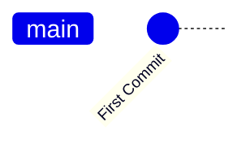

If you made some more changes, then added and commited again, your git structure would look like this:
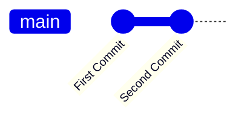

Now, make a branch and checkout that branch with:
```
git checkout -b new-feature
```

Add some new features, then add and commit like before. Now your git structure looks like this:

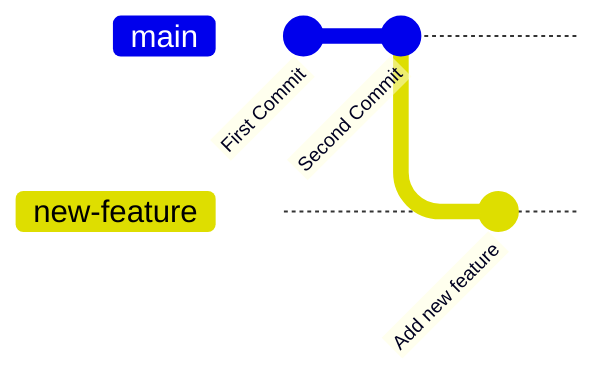

---

## Merging Branches

We use branches when we want to work on a new feature. When the feature is ready, we merge the branch. 

It is essential to use branches when collaborating with others! As you learn more throught this tutorial, this fact will become obvious. But for now, consider a scenario where you're working with others. If you have a stable version of your project, and you want to add a new feature, you don't want your changes that you're making to affect your collaborators as they work on different features as well. When you develop your changes, you're bound to have bugs, and you don't want these bugs to break the entire application. By creating and merging branches, you can work on changes sepratly from the main branch, and then you can merge your changes only once they are ready. This is the standard workflow when working on a codebase with others.


Merging Process:
1. Create new feature branch from the main branch
2. Make changes in the new branch and commit them
3. Checkout main branch (recieving branch)
4. Merge feature branch to the current recieving branch

```sh
git checkout <base-branch>
git merge <feature-branch>
```

### Fast-Forward Merge

Fast forward merege is possible when there are no further commits in the receiving branch after the commit where feature branch was created. For example:
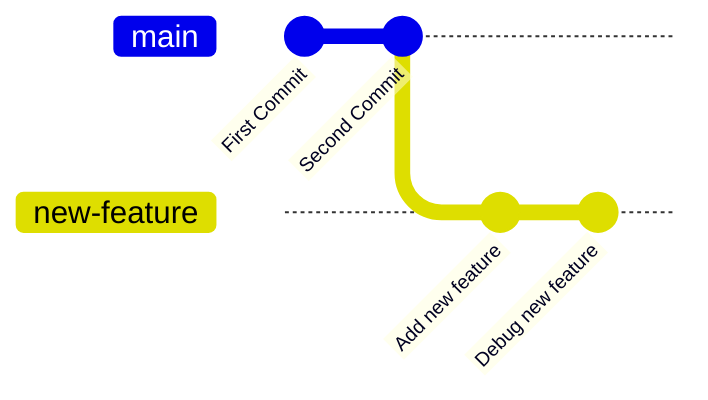

In this case, our git repo is able to perform a *fast-forward merge*. This is because `main` has no commits since the branch `new-feature` was created. A merge would look like this:
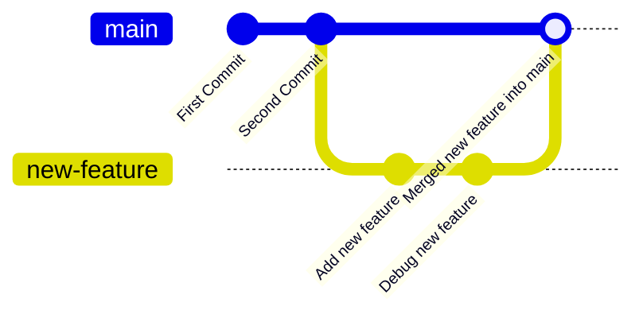

Under the hood, ***git sets the main branch pointer to the commit of the feature branch***. That's why its called *fast-forward merge*, the main branch pointer *fast forwards* through the commits to get to the new feature. 

Notice how the git history is almost identical to this:
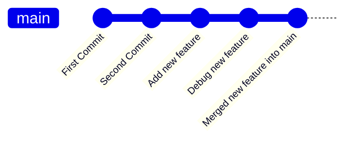
This should give you some intuition for when git uses a fast-forward merge, and what actually happens in a fast forward merge internally.


### 3-way merge

3 way merge happens when fast forward merge is not possible because some commits have been made in the recieving branch. For example:
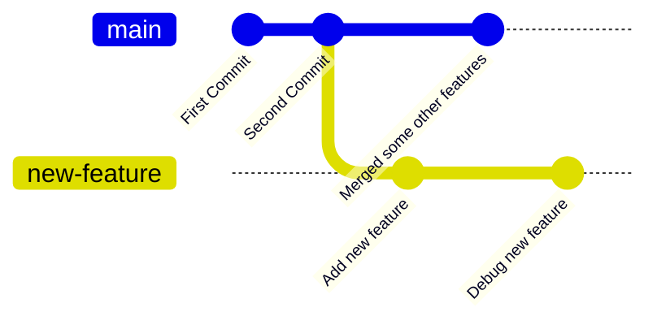

In this case, git cannot simply shift the HEAD pointer using a fast forward merge. It would lose information. It has to make a commit where it integrates the changes of both branches into one.

This commit has pointers to *2 parent commits* instead of the normal 1 parent. A merge would look like this:
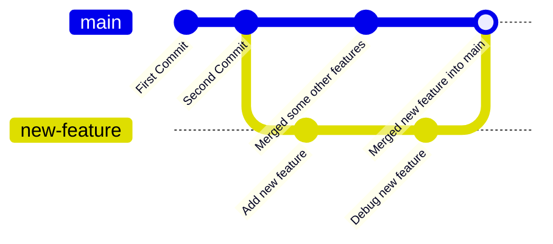

### Merge Conflicts
In a 3 way merge, if one or more files are modified by *both branches*, git needs the user to manually select which change it should keep. This is called a **merge conflict**.

When a merge conflic occours, the conflicting files will be moved to the staging area. Once the conflicts are fixed, run `git commit` and the merge will be completed. 

You also have the option to undo the merge with:
```sh
git merge --abort
```

When a conflic occours, git stores 3 blobs of the conflicting file. 1 blob is the original version, and the other 2 blobs are the 2 versions from the different branches.

To manage the conflict in a file, you can go in the file and manually edit which parts you want to keep and which parts you want to delete. You can also use vscode or another git gui software to pick which version of the file you want to keep.

Once you add a conflicted file, git will consider the conflict resolved.

---

## Cloning, Exploring, and Modifying Public Repositories

One of the main uses of git is to collaborate on code bases. You can access public code bases on Github. Github stores remote repositories. We will see how we can make changes to these *remote repositories* from our local machine.

### Cloning a repo
This is how you get a remote repository on your local machine.

1. Find a repository of your choice
2. Click the "Code" dropdown menu
3. select "HTTPS" and copy the url
4. Then, on your local machine, naviagte to a directory where you want to have the project, and execute the command below.

To clone a repo using https:
```sh
git clone <url>
```

### Working on repositories

To see difference in modified files vs old files
```sh
git diff
```

### Does a remote repository update itself automatically after local repository change?
No. You need to push changes from your local repository to the remote repository.

### Does a remote repository send updates to the local repo automatically?
No. You need to pull changes from remote to local.

### Who has rights to write to the remote repository?
Access is given by the remote repo owner.

### Who has access to read the remote repository?
If repo is public, everyone can read from it.

---

## Git Push, Fetch, and Pull

- `git push` pushes local changes to remote repo
- `git fetch` fetches updates from remote to local
- `git pull` does a fetch and then merges remote changes

### Difference between git fetch and git pull? 
Fetch will make changes to your git repository, but Pull will apply those changes to your working directory.

### How is your local git repo connected to the remote repository?
Git creates a default remote repository for your local repository. The name of this repository is called `origin` by default. In other words, `origin` *is the remote repository.*

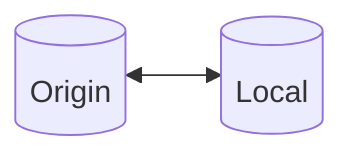

It is possible to have multiple remote repositories for a local repository. In that case, when you push, pull, or fetch, you have to specify which remote repo you want to use. By default, `origin` is used for commands push, pull and fetch.

### Git remote
To list all remote servers for a git repository: 
```sh
git remote      # returns all remote repos
git remote -v   # with their URL
```

To remote branches:
```sh
git branch -r   # remote branches
git branch -a   # remote and local branches
```

### Tracking Branch
A local branch that is connected to a specific remote branch. An example local and remote repository could look like this:

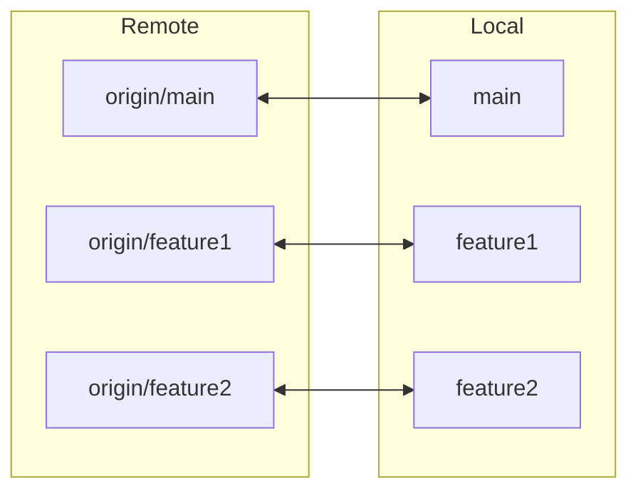

To list all *tracking branches*:
```sh
git branch -vv
```

To create a new tracking branch, you can use the git checkout command like normal, and git will automatically create a local branch to match the tracking branch:
```sh
git checkout <name of remote branch>
```

Use this command to see a lot of information about origin
```sh
git remote show origin
```

### Git Pull
Steps:
- Checkout a local branch and make sure it is a tracking branch
- Enter:
```sh
git pull
```
- Git will fetch all changes from remote repo using 
```sh
# this happens under the hood, you dont have to type this
git fetch
```
- After fetching, git updates FETCH_HEAD file that contains SHA1 hashes of last commits in remote repo for all tracking branches
- Git merges remote branch into current branch using 
```sh
git merge FETCH_HEAD
```


### Git push

Use git push to push some changes from local repo to remote:
```sh
git push
git push -v     #-v is for verbose, gives more information about command
```

In order to push, the current branch needs to be tracked. If you are are on a local branch that doesn't exist in the remote repo, you need to use this command to push your changes:
```sh
# creates a remote repository containing the contents of 'branch'
git push --set-upstream origin <branch>
git push -u origin <branch> # short version
```

this will create the tracked branch in the remote repository, then it will push your changes.

### Update tracking statuses
Suppose a new branch `temp` is created in the remote repository. Then we checkout `temp` locally using `git checkout temp`, creating a local copy of `temp`. Now, what happens if we delete `temp` in the remote repo and use `git fetch`. Suprisingly, the local `temp` branch still tracks the remote `temp` branch. To fix this issue, we need to *update tracking stauses*. We do this using:
```sh
git remote update origin --prune
```

### Deleting remote repositories
Once a remote branch is created (using `git push -u origin <branch>`), delete the newly created remote branch using:
```sh
git push origin -d <branch>
```

### Show Refs

Use this command to list and compare references. It shows the sha-1 hash of branches. You can use it to see if the local and remote branches point to the same commit:
```sh
git show-ref              # To see all local and remote refs:
git show-ref <branch>     # search by name
```

---

## Pull Requests

A Pull Request is a proposal of potential changes.
> This is one of the main reasons we put changes in branches. Make sure you are familiar with [Git Branches](#chapter-6-git-branches).

### Why is it called "Pull Request"
Its called a "pull request" because when developers were using git to collaborate, one developer would make some changes and push them, and then he would ask his colleagues to pull the changes so they could review them. Now with github, developers can review proposed changes without *actually* pulling them, but the name remains.

In fact, it might be more fit to call this feature a *merge request*, since developers are asking to merge their changes into the main branch.

### Steps to a Pull Request

1. Develop some changes to a codebase. Put these changes in a branch. When the changes are ready, push the new branch to the remote repository.
2. Go to github and open a new pull request for this branch.
3. Once pull request is open, other collaboraters will review your changes
4. When the pull request is reviewed, it will be merged to the base branch.

By default, you are allowed to merge a pull request without review from other collaborators. These settings can be changed.

Once the feature is merged, the merged branch can be safely deleted.

### Protected branches
You can make certain branches protected. By doing this, you configure certain requirments that pull requests must satisfy before they can be merged into this protected branch. This is where you can add required reviews, tests, and more.

---

## Forks and Contribution to Public Repositories

A forked repository is a copy of a repository from another account.

### How to sync forked repository with changes in the parent repository

When you initially fork a repository, your copy is not synced to the original, so any changes made in the original will not appear in your copy:

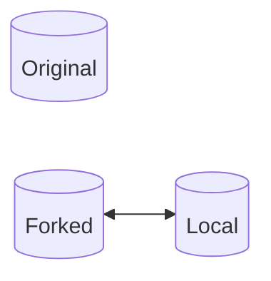

To get the changes made by the original, you need to add another remote server. It is convention to call it `upstream`. If you have this remote server, you will be able to pull changes from the original.

To make an upstream remote server:
```sh
git remote add upstream <url-of-original-repo>
```

Now are local repository is connected to the original:

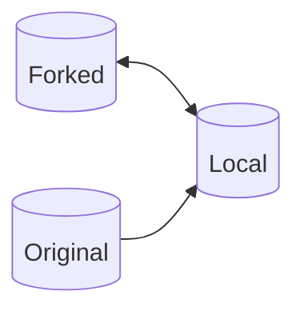

To fetch changes from upstream:
```sh
git fetch upstream
```

To pull changed from upstream:
```sh
git pull upstream master # master could be "prod" or "main"
```

After changes are pulled from upstream, we still need to push the changes to our forked repo. Thus, the general workflow to sync original repo with forked repo looks like this:
```sh
git pull upstream master
git push
```

### How to open pull request in the parent repository from the forked repository

Same process as normal.

## Git Tags

Tags are static text pointers to a specific commit. Ie. they do not move like commit pointers do.

Tags are used to create versions of your code. This is important when others rely on the software you produce.

### Semantic Versioning

Versions follow the `Major.Minor.Patch` convention. 

Major are large additions or modifications to your code base. They likley break programs that rely on the previous major version. Major releases introduce new features and functionality.

Minor changes are small additions or fixes to your code base. They should not break programs that rely on the previous minor version. Minor releases introduce small new features and improvments.

Patches are even smaller changes to the code,. They should never break programs that rely on the previous patch version. Patches introduce bug fixes.

You can also have release versions: `Major.Minor.Patch-ReleaseName`. This is usually done for new versions that are almost ready to be released but need to be tested before considered stable. Example release names are `alpha` or `beta` or just a release version (`1.2.3-beta`, `1.2.3-1.2`)

For more info read the [Semantic Versioning Docs](https://semver.org/).

### Tags

In git there are ***lightweight tags*** and ***Annotated Tags***

**Lightweight:**
- Only stores version
- stored in `.git/ref/tags`
  
To make a lightweight tag:
```sh
git tag v1.0.0
```

**Annotated:**
- Stored as git object (See [Git Objects](#git-objects) for refresher)
- stored in `.git/refs/tags` and in `.git/objects`
- stores tag message
- stores author and date

To make an annotated tag:
```sh
git tag -a v1.0.0 -m "Tag message"
```

### Pushing Tags to Remote

When you create a tag locally, it is not automatically pushed to the remote server. If you wish to push your locally created tags to the remote server, use:
```sh
git push --tags         # push all tags
git push origin <tag>   # push a specific tag
```

### Publishing releases on github

You can publish releases of your code on github. When publishing releases, tags are used to specify the version of the release.

---

## Rebasing

Rebasing is an alternitive way to merge two or more branches together.

### Merging vs Rebasing
The difference between merging and rebasing is the history of changes. Rebasing flattens the commit history graph and makes commit history linear as apposed to having history of changes with branches.

Additionally, rebasing is a way to avoid a 3 way merge. Rebasing restructures the commit history such that when its time to merge changes, a fast-forward merge is possible.

### How to perform a Rebase

Suppose we have the following branch structure:

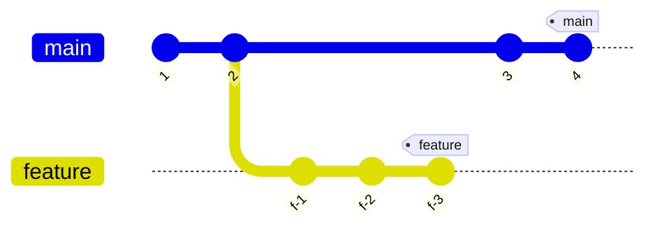

 Right now the feature branch and base branch would require a 3-way-merge if we were to merge them. This is how you can merge the feature branch into the base branch using rebasing. In this example I'll use `main` as my base branch.


Steps:
1. Checkout feature branch
2. Rebase feature branch on top of the base branch
3. Checkout base branch
4. Merge feature branch into base branch. Fast forward merge will be used

These are the commands:
```sh
git checkout feature
git rebase master
git checkout master
git merge feature
```

By doing steps 1 and 2, we change the commit history to look like this:

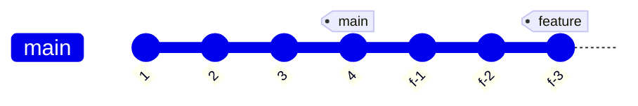

From here, steps 3 and 4 merge feature into main to get: 

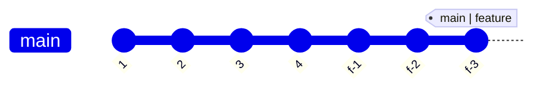

Notice how the graph is flat. Git did not store the fact that feature used be a branch. In cases when you would perfer a flat main branch with no merging history, use rebase. Otherwise, use merge.

---

## Ignoring Files in Git

In git we have the ability to ignore files and folders that we don't want to track. We use a file called `.gitignore` to sepecify which folders and files must be commited. `.gitignore` is added in the root of a git project and is usually added when a repository is first created.

### Git ignore rules
Inside .gitignore, type the files and folders you want to ignore.

```sh
# in .gitignore

# to ignore a single file
ignorefile.txt

# to ignore a folder
node_modules/

# ignore all .in files
*.in
```

### Best practices and common use cases
We want to ignore large files and folders that are automatically generated. For example:
- build folders like `bin/`
- dependancy folders like `node_modules/`
- compiled and log files like `*.pyc, *.log`
- Hidden OS files like `Thumbs.db, .DS_Store`

When you make a repository on github, it has .gitignore templates for different project types.

---

## Advanced Git Commands

### Git Reset

Git reset allows you to undo commits and access previous changes of your repository. This command should never be used on public branches because it modifies git history. However, on the local banch this is a helpful command. Git revert will revert to a previous commit and make it the latest commit. This means all commits after it will be discarded.

Run this command to revert to a previous commit:
```sh
git reset <hash>
```
After this command, file contents do not change. But commited changes will be uncommited, so you will have the option to make changes to your changes and then do another commit. Commited files will be unstaged.

You can use the `--soft` option if you want the changes to remain staged. This will reset the commit to the one provided but it will leave changes staged:
```sh
git reset --soft <hash>
```

You can also use the `--hard` option. Using this option will undo commited changes and revert files to their previous version. You will lose history of the changes you had before reseting: 
```sh
git reset --hard <hash>
```
This is the most destructive option, use with caution!

### Git Revert
Git revert will undo changes made by a specific commit, but it applys those changes ***as a new commit***. Git revert is safe and does not modify history.

```sh
git revert <hash>
```

If you need to undo a commit on a remot repository, git revert is your only option!!! You cannot use git reset!!!

### Git commit --amend
This command is used to modify the information of the latest commit (ONLY latest commit). Under the hood, this operation is destructive as git deletes the latest commit object and replaces it with a new one. So it should only be used on private branches.

This command is used to change the message:
```sh
git commit --amend -m <message>
```

You can also change the author 
```sh
git commit --amend --author="Author Name <sample@email.com>" # include <>
```

### Cherry Picking Commits
Cherry picking is used when you have a specific commit that you want to merge into a base branch without merging the entire branch:
```sh
# checkout the base branch first
git cherry-pick <hash>

# to make the changes without commiting
git cherry-pick --no-commit <hash>  # -n for short

# to commit with a standardized commit message
git cherry-pick -x <hash>
```

This is what cherry picking does to the git structure. Suppose this is our git repository so far. 

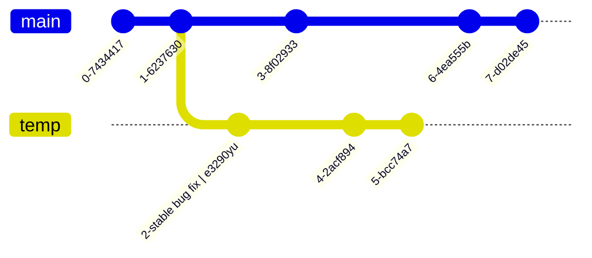

I want to merge `2-stable bug fix` into main. Lets run:

```sh
git checkout main
git cherry-pick e3290yu
```

This will produce:

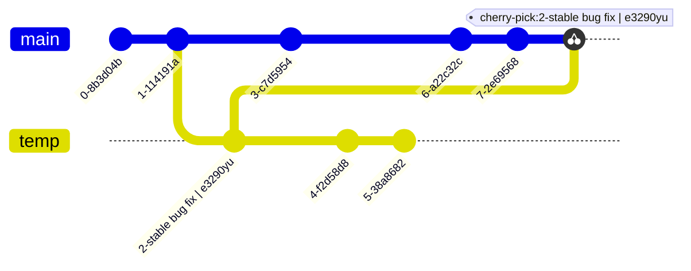

### Git Reflog
Output a log of all operations of a git repository. It only works on a local repository.
```sh
git reflog
git reflog show <branch>
```

### Stashing
You can use stashing to temporarly save changes without commiting. Then you can apply them in another branch or after some changes.

To stash changes:
```sh
git stash
```

To apply changes:
```sh
git stash pop
```

### Squashing Commits
When you have some commits that you would perfer to be represented by only one commit, you can *squash* them.

One place this occours in when approving a pull request on a remote repository. Github gives you the option to squash commits when you approve a pull request.

Another way to squash commits is to use interactive rebasing:
```sh
# provide the hash of the last commit you want to squash
git rebase -i <hash>
```

### Git Log Options

```sh
# formatting
git log --oneline       # display one line per entry
git log --graph         # display graph beside entry
git log --stat          # shows the type of modification made
git log -p              # view file changes in terminal
# all of them
git log --oneline --graph --stat -p

# shortlog
git shortlog            # See commit history of all collaborators
git shortlog -n         # sort by number of commits
git shortlog -s         # summary
git shortlog -e         # email
git shortlog -n -s -e   # all of them

# filters
git log --author="<author>"     # filter by author
git log --grep="<string>"       # filter by keyword
git log --merges                # show only merges
git log --no-merges             # omit merges
```

